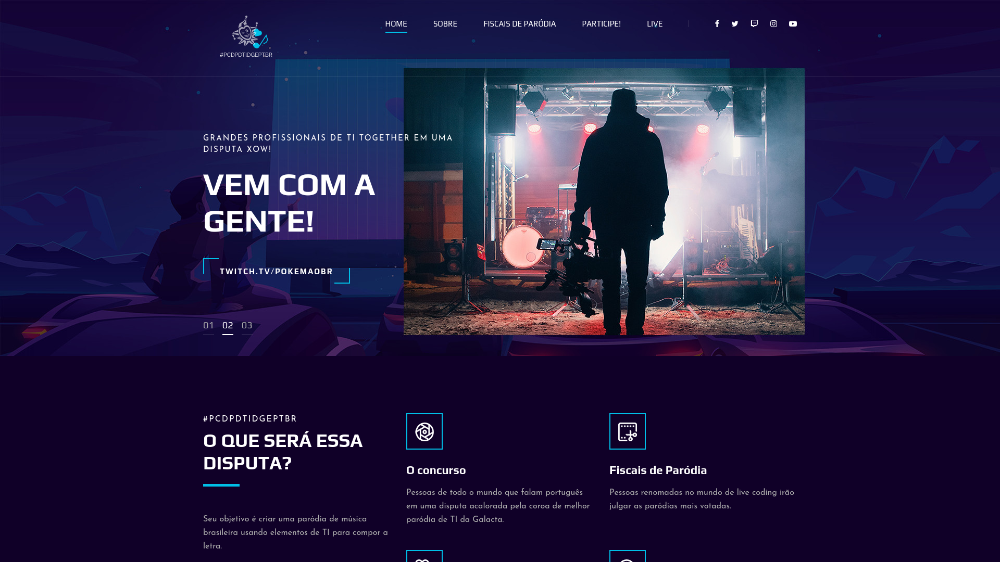
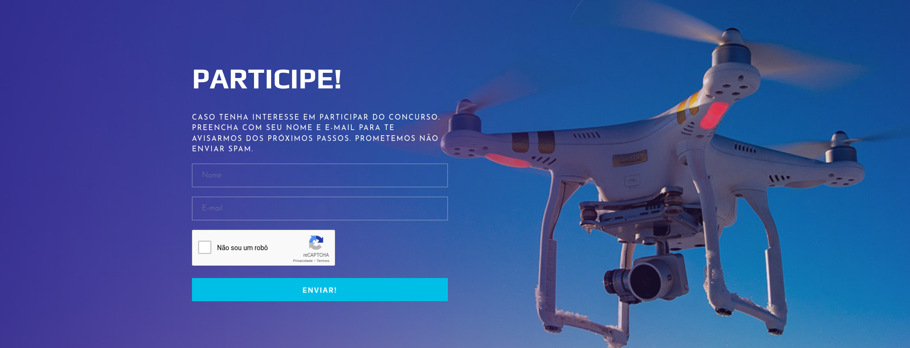

# Parodias.dev

[Parodias.dev](https://parodias.dev) é um projeto de desenvolvedores para desenvolvedores. Onde **criamos paródias com músicas, e a bancada decide qual é a melhor**.

O concurso tem dois lados em sua competição:

- Os Candidatos, que apresentam as suas paródias
- A Bancada, que julga as paródias com comentários inteligentissímos

## Regras

- **A Paródia deve ter de 1 minuto e meio, até 4 minutos**
- **Deve ser uma música nacional**
- **Deve ser criativa**

## Bancada

A bancada do [Parodias.dev](https://parodias.dev) é composta por:

- Pachi Codes
- JP O Brabo
- Levxyca
- Freaky Fog
- Nario
- Carol Donadel

## Participe!

Caso queira participar, apenas preencha o seu nome e email no final do site na **sessão do formulário de participação**.

